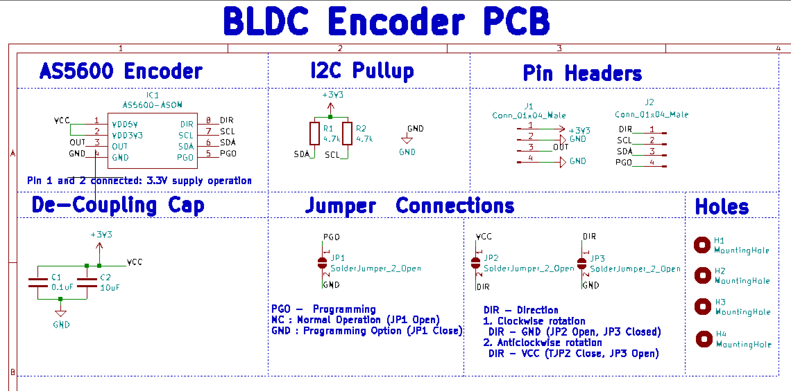

# BLDC-Encoder-PCB

This repository contains KiCAD Design Files for Encoder PCB made using AS5600 hall sensor based Encoder Chip for [SRA-VJTI](https://github.com/SRA-VJTI/)'s BLDC Actuator and Quadraped Testing.

## Schematics

## Renders

### Front View

### General View

